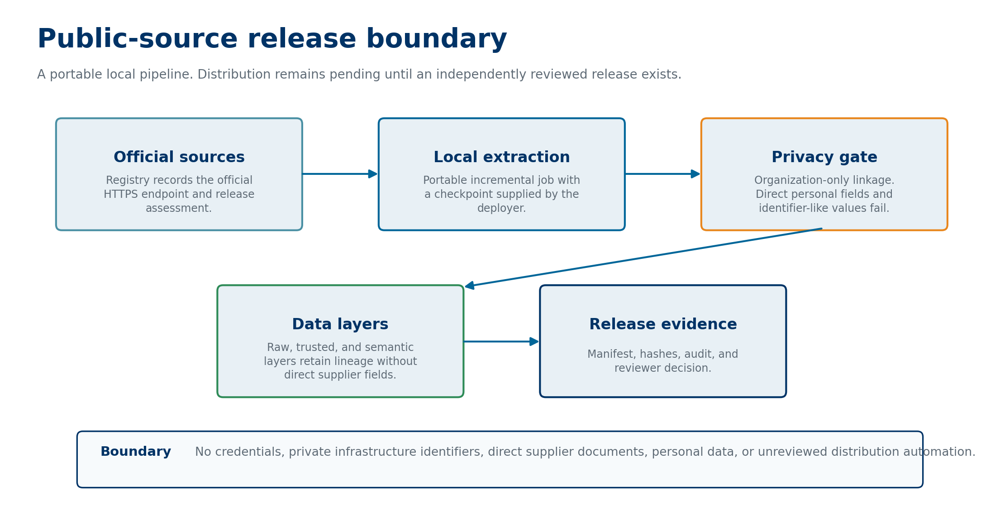
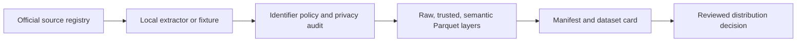

# Brazil public data map

An executable map of Brazilian public education and procurement sources. The project turns a source registry and a small synthetic PNCP fixture into reviewable raw, trusted, and semantic Parquet layers. It prioritizes local reproduction. A reader needs no cloud account, credential, large data dump, or private infrastructure.



## Current release controls

- registry of official INEP, FNDE, IBGE, and PNCP sources;
- organization-only PNCP identifier policy;
- SHA-256 release manifest with source lineage and privacy approval;
- registry validation and a layer-wide privacy audit;
- fixture-first tests that run without private infrastructure.

## Architecture and local workflow



The release path writes three Parquet layers, `privacy-audit.json`, and `manifest.json`. The manifest records only the declared package files, so stale files in an output directory do not silently become part of a release record.

## Quick start

```powershell
python -m unittest discover -s tests -v
make check
python -m brazil_data_map validate-registry
python -m brazil_data_map build-fixture-release --output .local-release --retrieved-at 2026-01-03T00:00:00Z
```

## Privacy boundary

The release gate excludes natural-person and unknown supplier records. It never preserves a supplier document, name, contact, or address in the released record. Eligible CNPJ records receive a deterministic `golden_organization_id` for linkage only. It is not identity verification or supplier qualification.

[contracts/identifier-policy.yaml](contracts/identifier-policy.yaml) defines the rule. The audit also rejects CPF-like and email-like strings that appear in an otherwise permitted field.

## Kaggle policy

Kaggle is the planned distribution channel for reviewed release artifacts. No Kaggle link or publishing automation appears here until an account exists and a release passes the source, terms, privacy, and manifest gates.

Read the planned release boundary in [docs/dataset-card.md](docs/dataset-card.md).
The implementation contract is in [docs/release-contract.md](docs/release-contract.md).
The [source catalog](docs/source-catalog.md), [join map](docs/join-map.md), and [data dictionary](docs/data-dictionary.md) document the public analytical boundary.

## Portability

`dags/pncp_incremental_update.py` is an Airflow template. It has no token, bucket, project ID, or environment connection. A deployer supplies approved connections and local output paths in their own Airflow environment.

The local command builds raw, trusted, and semantic Parquet layers, `privacy-audit.json`, and `manifest.json` from synthetic records. Pass the same `--retrieved-at` value twice to reproduce the manifest hashes. Git ignores `.local-release`. Delete it after inspection.

Open [notebooks/01_local_release_walkthrough.ipynb](notebooks/01_local_release_walkthrough.ipynb) to run the same synthetic path interactively.

## Testing

`make check` compiles the package, validates the registry, and runs fixture-backed tests. The suite covers retry and pagination behavior, natural-key deduplication, identifier classification, field and value leakage, schema and timestamp validation, layer reconciliation, manifest requirements, notebook validity, and deterministic Parquet release hashes.

## Articles and case study

The first article draft, [Public data is not automatically privacy-safe](articles/public-data-is-not-automatically-privacy-safe.md), explains the release gate and links its claims to [evidence](articles/public-data-release-claim-map.md). The follow-up drafts cover [organization linkage limits](docs/articles/golden-organization-id-without-identity-overreach.md) and [policy testing](docs/articles/testing-a-privacy-policy-like-software.md). They remain Markdown review artifacts until manual publication.

## Limitations

The current repository does not contain a historical dataset, live extractor credentials, a source-terms conclusion, or a public distribution link. It does not certify legal compliance. A real release must complete source-specific retrieval, terms review, schema review, privacy audit, and reviewer approval before distribution.

## License

[Apache-2.0](LICENSE).
