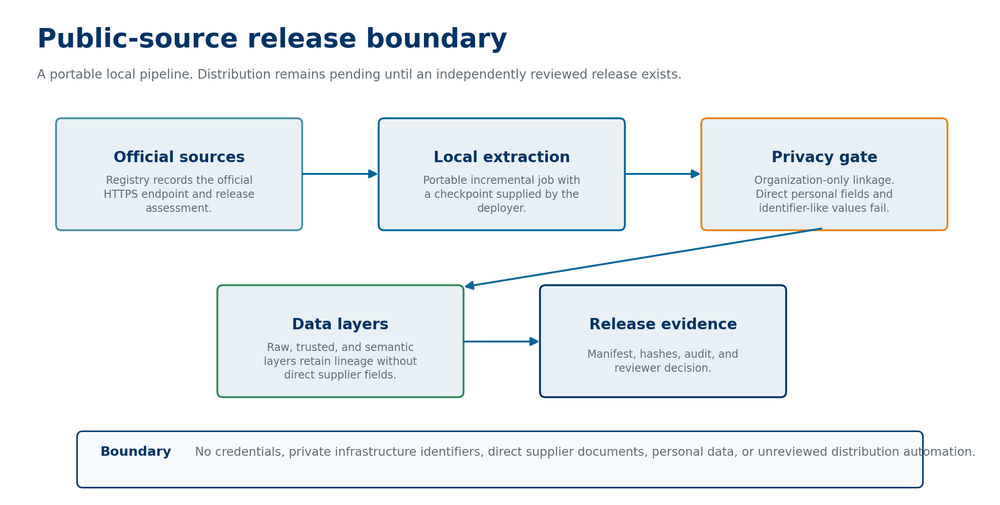

# Dataset card: Brazil PNCP procurement history

## Status

Kaggle hosts version 3 as [Brazil PNCP Procurement History: bounded item sample](https://www.kaggle.com/datasets/lucasrangelss/brazil-pncp-procurement-history). The current package covers publication date 2026-09-20 for modality 6: 25 procurement parents and 513 item records in each Parquet layer. Its manifest, approval record, and three layers preserve that limit. Earlier releases remain in Kaggle version history. It does not claim PNCP-wide historical coverage.

## Intended content

The release contains eligible public procurement records in raw, trusted, and semantic Parquet layers. The raw layer preserves source-minimized fields and lineage. The trusted layer keeps the latest record per natural key. The semantic layer adds documented analysis keys. Document binaries, free-text notice subjects, and unnecessary direct identifiers remain out of scope.

## Privacy and limitations

The release gate excludes natural-person and unknown supplier documents. It derives an organization linkage key only for an eligible CNPJ record. Public source availability does not settle redistribution terms; each source requires a release-time review. The [PNCP open-data page](https://www.gov.br/pncp/pt-br/acesso-a-informacao/dados-abertos) is the starting point for source access, while the package remains subject to the release contract.

## Reproducibility

Run `make check` to validate the fixture pipeline. The [version-3 evidence record](evidence/pncp-kaggle-release-v3.md) records the manifest identity and clean-download validation. The Airflow template is portable and does not contain Kaggle credentials, storage locations, or infrastructure identifiers.
