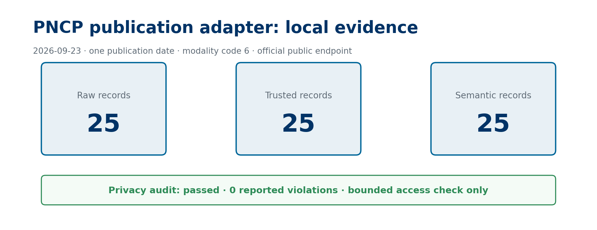

# PNCP publication adapter evidence

## Capture context

- Capture date: 2026-09-23
- Command: `python -m brazil_data_map fetch-pncp-publications --start 2026-09-20 --end 2026-09-20 --modality-id 6 --output .local-pncp-release`
- Source: `https://pncp.gov.br/api/consulta/v1/contratacoes/publicacao`
- Scope: one publication date and modality code 6

## Result

The adapter retrieved 25 records. The release path wrote 25 raw, 25 trusted, and 25 semantic records. The privacy audit passed with no reported violations.

## Sanitized output fields

`id`, `updated_at`, `published_at`, `procurement_year`, `procurement_sequence`, `item`, `modality_id`, `estimated_value`, `contracting_organization_id`, `contracting_organization_name`, `source_record_url`, `identifier_classification`, and `source_id`.

## Caption and alt text

Caption: Local PNCP publication-window run completed with matching layer counts and a passed privacy audit.

Alt text: A terminal validation run reports 25 raw, trusted, and semantic records and zero privacy-audit violations.

## Limitation

This is a bounded source-access check, not a historical release, dataset publication, or legal assessment of redistribution terms.
