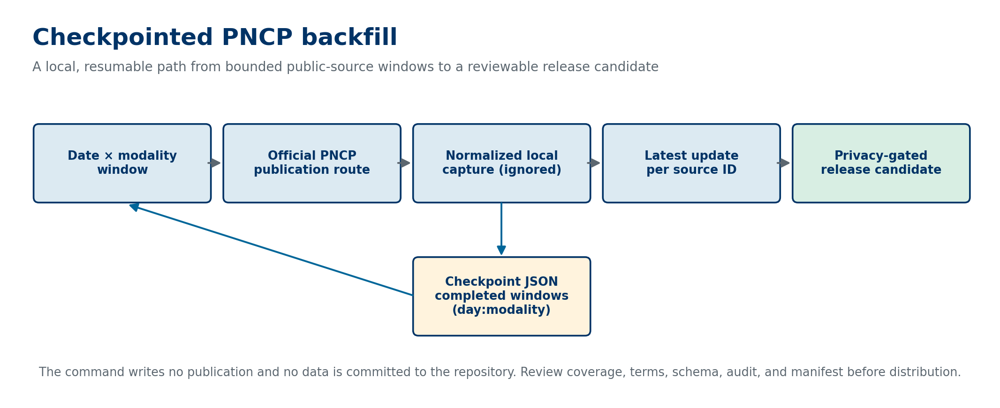

# PNCP checkpointed backfill

The backfill command retrieves selected PNCP publication windows from the official public route. Each window combines one calendar day and one modality ID. The command retains only an allowlisted analytical subset of the response, writes it to a local ignored capture, and records completion in `checkpoint.json` after the window finishes.



## Why the checkpoint exists

Public APIs can fail after part of a long acquisition has completed. The checkpoint prevents a resumed run from requesting completed windows again. If a process stops before the command records a completed window, rerunning that window can append duplicate records; the release builder resolves those duplicates by source ID and the latest `updated_at` value. This makes the final release deterministic for a fixed capture.

The local capture and checkpoint are implementation artifacts. Git ignores them because they may contain public-source records that still need a release review. The repository stores code, tests, metadata contracts, and sanitized evidence instead.

## Command contract

```powershell
python -m brazil_data_map backfill-pncp `
  --start 2025-01-01 `
  --end 2025-01-07 `
  --modality-ids 1,6,8 `
  --output .local-pncp-backfill `
  --git-commit (git rev-parse HEAD)
```

`--start` and `--end` define the date coverage. `--modality-ids` must contain positive integer codes accepted by the official route. `--output` is a local directory, and the repository ignores the recommended `.local-pncp-backfill` path. The optional commit argument records the extractor revision in the release manifest.

The command returns counts for fetched windows, completed windows, deduplicated records, and the three release layers. Its manifest records the source URL, retrieval time, input SHA-256 digest, layer counts, extractor commit, file hashes, schema version, privacy result, and distribution state. `distribution_version` stays `not_published` until a reviewed distribution exists.

## Bounded live execution

On 2026-09-23, the command ran against the official PNCP route for one window: 2026-09-20 and modality 6. It fetched 25 normalized records, produced 25 raw, 25 trusted, and 25 semantic records, and passed the privacy audit with zero violations. Repeating the command used the local checkpoint and fetched zero additional windows.

This was a source-access and resume test. It is not a historical dataset, a source-terms conclusion, or a public release. Any distributed dataset must state its date and modality coverage precisely, complete the release contract, and have a separate reviewer decision.

## Claim-to-evidence map

| Claim | Evidence | Status |
| --- | --- | --- |
| A completed window is skipped on rerun. | `tests/test_backfill.py::test_resumes_completed_windows_and_writes_lineage`; live rerun fetched zero windows. | Supported |
| Duplicate source IDs resolve to the latest update. | `tests/test_backfill.py::test_deduplicates_to_latest_update_deterministically`. | Supported |
| The bounded live execution produced matching layer counts and passed the audit. | Sanitized command output recorded above; [earlier source-access evidence](evidence/pncp-publication-run-2026-09-23.md). | Supported |
| The command is sufficient for public redistribution. | No distribution review, historical coverage, or release version exists. | Not claimed |

## Review checklist before distribution

- Confirm the exact date and modality coverage.
- Review current source terms and the selected fields.
- Run the privacy, schema, reconciliation, and manifest gates.
- Inspect the data manually for source-specific surprises.
- Record the dataset version only after the separate distribution operation succeeds.
